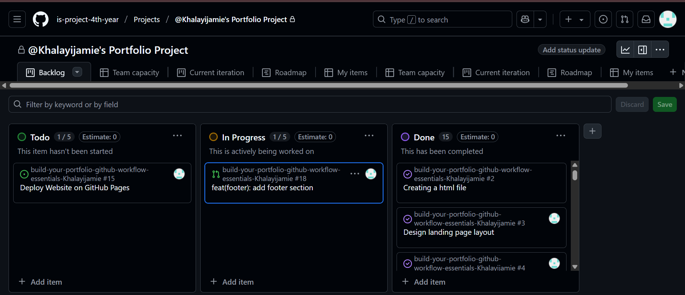
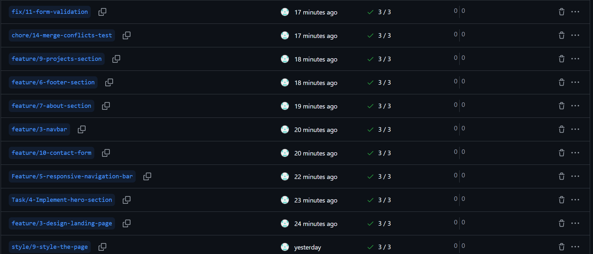
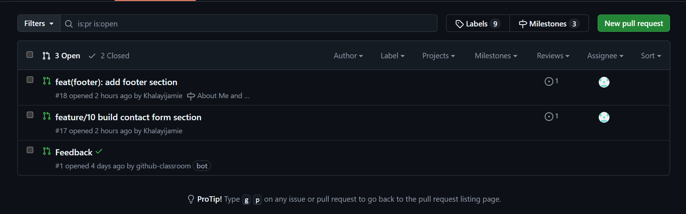
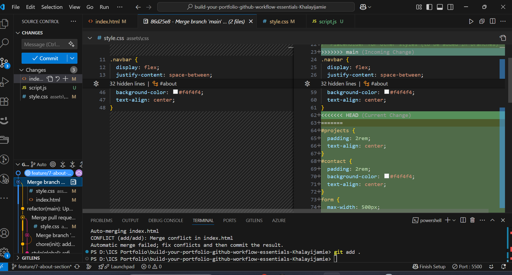

# Personal Portfolio Documentation

## 1. Student Details

- **Jamie Khalayi Nangulu**:
- **KhalayiJamie**:
- **Jamie.khalayi@gmail.com**:

## 2. Deployed Portfolio Link

- **GitHub Pages URL**:  
https://is-project-4th-year.github.io/build-your-portfolio-github-workflow-essentials-Khalayijamie/
## 3. Learnings from the Git Crash Program

Below are four key Git concepts I learned during the crash course and how they helped me manage my portfolio project more effectively:

---

### 1. **Branching**

Branching helped me separate features like the navbar, hero section, and contact form into isolated environments. This allowed me to work on one section at a time without interfering with the main codebase, reducing bugs and merge conflicts.

---

### 2. **Pull Requests (PRs)**

Using pull requests allowed me to review my changes before merging them into the `main` branch. It also gave me a structured way to document what each feature or fix was about, ensuring my repository stayed organized and easy to understand.

---

### 3. **Commit Conventions**

Structured commit messages (e.g., `feat(navbar): add responsive navigation`) helped me clearly describe what each change did. This made it easier to track progress, especially when linking commits to specific issues or features on my project board.

---

### 4. **Project Boards and Issues**

Creating issues and using a GitHub project board helped me break the project into manageable tasks. I could track what was “To Do”, “In Progress”, or “Done”, which gave me a clear overview of my development process and helped me stay organized.

---

### 5. **GitHub Pages Deployment** 

Learning how to deploy with GitHub Pages gave me a live preview of my portfolio website. This helped me test each feature after merging and allowed me to confidently present a working version of my project online.


## 4. Screenshots of Key GitHub Features


```markdown

```

### A. Milestones and Issues

- Screenshots/Milestones and Issues/milestone and issues.png

### B. Project Board

```markdown
 
```
### C. Branching

```markdown
 
```
### D. Pull Requests

```markdown
 
```
### E. Merge Conflict Resolution

```markdown
 
```
